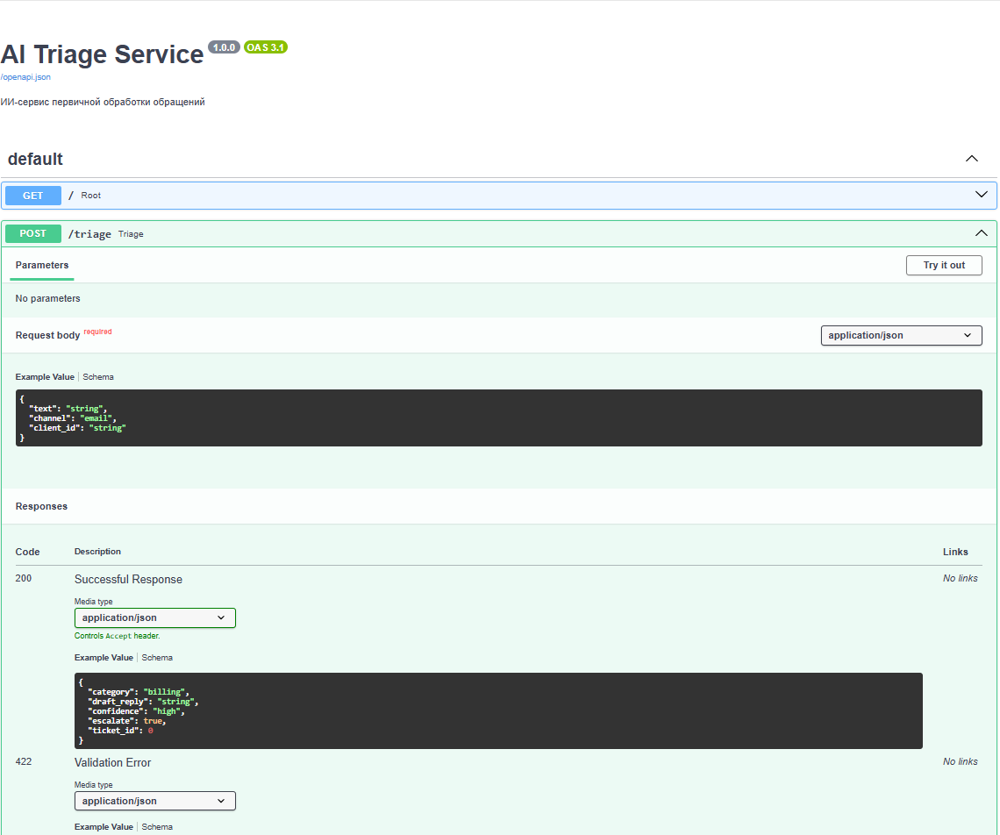
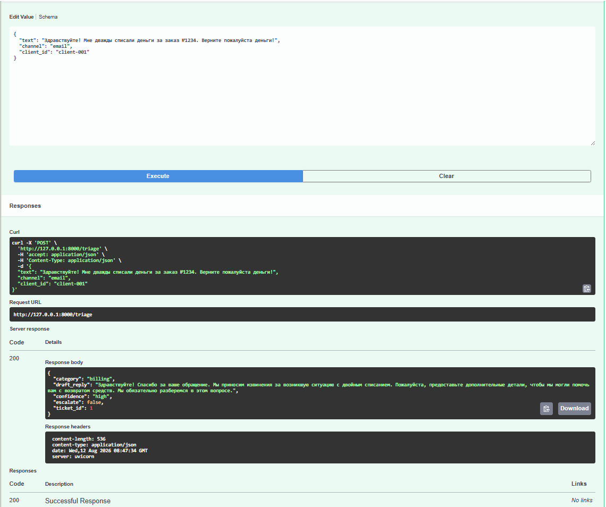
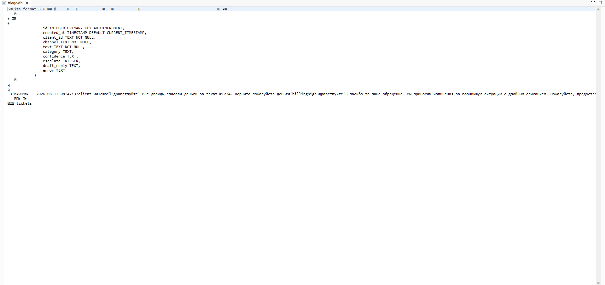

# 🤖 AI Triage Service — ИИ-сервис первичной обработки обращений

**Проблема:** менеджеры тратят время на ручную сортировку обращений клиентов из разных каналов → падает скорость реакции, растёт нагрузка, нет прозрачности и истории.

**Решение:** API-сервис на базе LLM автоматически классифицирует обращения по типу (billing / support / complaint / other), генерирует черновик ответа, передаёт сложные случаи оператору (эскалация), сохраняет всю историю в БД.

**Результат:** скорость реакции в разы выше, нагрузка на операторов снижается, каждое обращение зафиксировано и может быть проанализировано.

---

## 🖥 Скриншоты

### Swagger UI (автодокументация API)

### Пример ответа API

### Журнал обращений в БД (SQLite)

---

## 🛠 Стек технологий

- **Python 3.10+**
- **FastAPI** — современный фреймворк для API с автодокументацией
- **OpenAI-совместимый API** (ProxyApi) — интеграция с LLM (gpt-4o-mini)
- **SQLite** — журнал обращений и аудит
- **Pydantic** — валидация входных и выходных данных
- **Docker** — контейнеризация для развёртывания

---

## 🔌 API Endpoints

### `POST /triage` — основная точка входа

Обрабатывает одно обращение клиента: классифицирует, пишет черновик, записывает в БД.

**Вход (JSON):**

| Поле | Тип | Описание |
|---|---|---|
| `text` | string (1–2000 символов) | Текст обращения (обязательно) |
| `channel` | `"email"` / `"form"` / `"chat"` | Источник обращения |
| `client_id` | string | ID клиента |

**Выход (JSON):**

| Поле | Тип | Описание |
|---|---|---|
| `category` | `"billing"` / `"support"` / `"complaint"` / `"other"` | Категория обращения |
| `draft_reply` | string (1–6 предложений) | Черновик ответа клиенту |
| `confidence` | `"high"` / `"medium"` / `"low"` | Уверенность модели |
| `escalate` | boolean | Передать оператору? |
| `ticket_id` | integer | ID записи в БД (аудит) |

### `GET /` — проверка статуса

Возвращает `{"status": "ok", "service": "AI Triage Service"}`, если сервис жив.

---

## 📮 Пример запроса

    curl -X POST http://127.0.0.1:8000/triage \
      -H "Content-Type: application/json" \
      -d '{
        "text": "Здравствуйте! Мне дважды списали деньги за заказ №1234. Верните пожалуйста деньги!",
        "channel": "email",
        "client_id": "client-001"
      }'

**Ответ:**

    {
      "category": "billing",
      "draft_reply": "Здравствуйте! Спасибо за ваше обращение. Мы проверим информацию о двойном списании по заказу №1234 и свяжемся с вами в течение 24 часов для решения вопроса о возврате средств.",
      "confidence": "high",
      "escalate": false,
      "ticket_id": 1
    }

---

## 🚀 Локальный запуск (5–10 минут)

1. Клонируй репозиторий: `git clone https://github.com/erdpav-cmd/ai-triage-service.git`, затем `cd ai-triage-service`

2. Создай виртуальное окружение и установи зависимости: `python -m venv venv`, затем `venv\Scripts\activate` (Windows) или `source venv/bin/activate` (Mac/Linux), затем `pip install -r requirements.txt`

3. Создай файл `.env` по образцу `.env.example` и впиши свой LLM-ключ:

    LLM_API_KEY=твой_ключ
    LLM_BASE_URL=https://api.proxyapi.ru/openai/v1
    LLM_MODEL=gpt-4o-mini
    RATE_LIMIT_PER_MINUTE=5

4. Запусти сервис: `uvicorn app.main:app --reload`

5. Открой http://127.0.0.1:8000/docs и отправь тестовый запрос.

---

## 🐳 Запуск в Docker

    docker build -t ai-triage-service .
    docker run --env-file .env -p 8000:8000 ai-triage-service

Сервис будет доступен на http://127.0.0.1:8000, документация — на http://127.0.0.1:8000/docs

---

## 💾 Где смотреть данные

- **SQLite:** файл `triage.db` в корне проекта (таблица `tickets` — журнал всех обращений, включая ошибки)
- **Логи:** вывод терминала, где запущен uvicorn

---

## 🛡 Надёжность и безопасность

- ✅ **Валидация входа** — длина текста 1–2000 символов, обязательные поля, допустимые значения `channel`
- ✅ **Секреты только через `.env`** — API-ключ LLM не хранится в коде и не попадает в Docker-образ
- ✅ **Лимит запросов** — не более N запросов/мин на `client_id` (настройка в `.env`), защита от спама
- ✅ **Сценарий «если всё сломалось»** — при ошибке LLM возвращает `escalate=true` и шаблон «передано оператору», ошибка сохраняется в БД
- ✅ **Журналирование** — все запросы пишутся в БД, даже при ошибках

---

## 🚀 Планы по улучшению (v2)

- **RAG (Retrieval-Augmented Generation)** — подключение базы знаний компании для более точных ответов
- **Мониторинг** — Prometheus + Grafana для метрик: количество обращений, время ответа, процент эскалаций
- **Админ-панель** — веб-интерфейс для просмотра журнала обращений и ручной обработки эскалаций
- **Интеграция с реальными каналами** — Telegram-бот, email через SMTP, веб-форма на сайте
- **A/B-тестирование промптов** — сравнение разных системных промптов для оптимизации качества
- **Мультиязычность** — определение языка обращения и ответ на том же языке

---

## 📂 Структура проекта

    ai-triage-service/
    ├── app/
    │   ├── __init__.py
    │   ├── main.py          # FastAPI приложение, endpoints
    │   ├── models.py        # Pydantic модели (вход/выход)
    │   ├── database.py      # Работа с SQLite
    │   ├── llm_client.py    # Интеграция с LLM через ProxyApi
    │   └── rate_limiter.py  # Лимитирование запросов
    ├── screenshots/         # Скриншоты для README
    ├── requirements.txt
    ├── Dockerfile
    ├── .dockerignore
    ├── .env.example
    ├── .gitignore
    └── README.md

---

## 📊 Статус проекта

✅ **Завершён** — MVP полностью рабочий, протестирован, упакован в Docker.

---

## 👤 Автор

**Павел Эрдниев** | Junior Python Developer

📬 Telegram: [@Erdpav](https://t.me/Erdpav)
🔗 GitHub: [github.com/erdpav-cmd](https://github.com/erdpav-cmd)
🐙 Проект: [github.com/erdpav-cmd/ai-triage-service](https://github.com/erdpav-cmd/ai-triage-service)

---

*Создаю инструменты, которые экономят время и решают бизнес-задачи.*
